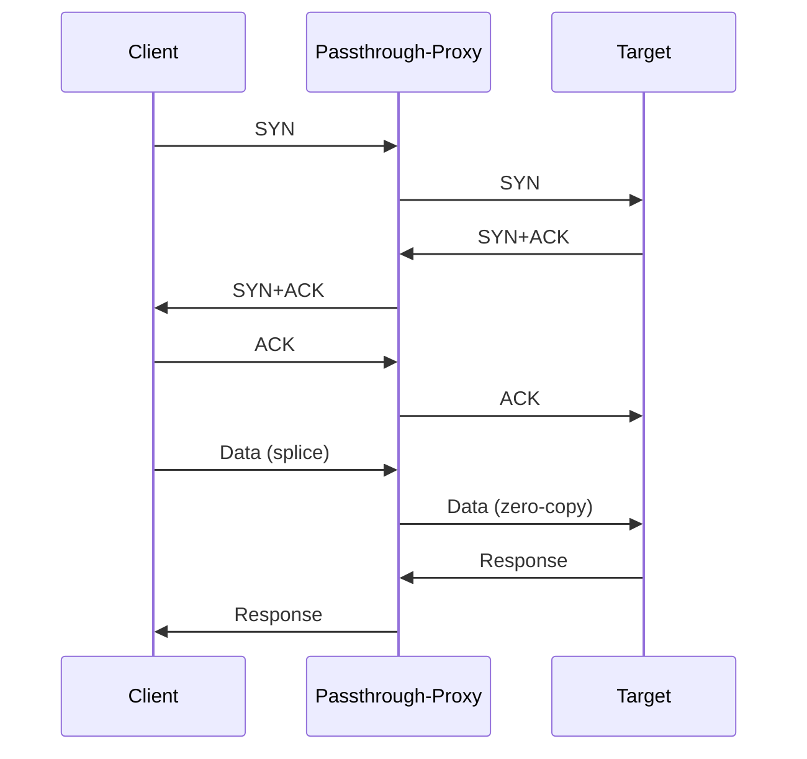
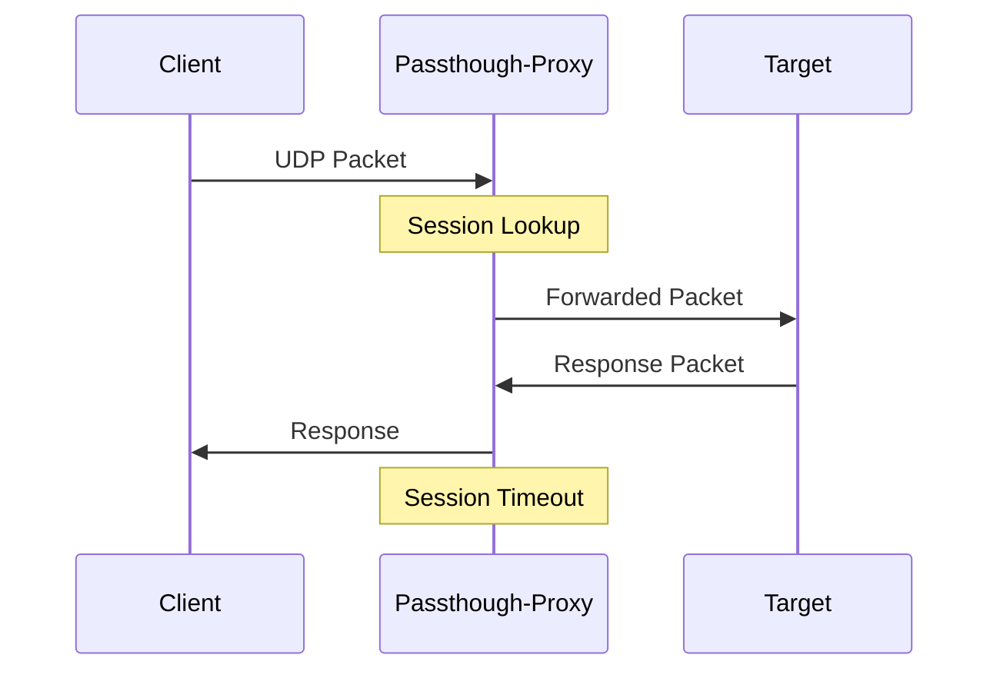

# Lite Passthrough Proxy

이 프로젝트는 C++20으로 작성된 Pass-through 프록시 서버입니다. 저사양 서버에서 작동하기 위해 최대한 경량형 운영에 초점을 두고 작성했습니다.

## What is this?

프록시 서버입니다. 

작성목적은 DNS Record 에서 반드시 보일 수 밖에 없는 서버의 IP를 숨기기 위한 용도로 만들어졌습니다. (예: smtp, xmpp, coturn 등)

tcp, udp를 모두 지원하며 저사양 서버에서 아주가볍게 작동하도록 모든데이터(packets, payload 등)을 메모리에 관리하지않고 그대로 흘려보내는 pass-through 방식으로 작동합니다.

## Prerequisite

아래 사양과 조건으로 작성되었습니다.

- CPU: Intel Xeon E5-2680v4 x 2
- RAM: 2GB 
- Linux kernel 5.4+
- GCC 11+ or Clang 14+ (C++20)
- CMake 3.20+

---

## Features

- YAML 포맷 설정
- Pass-through간 애플리케이션 메모리에 모든데이터(payload 포함) 관리를 하지않고 커널에서 소켓 간 그대로 직접 전달 (zero‑copy)
- IPv4/IPv6, TCP/UDP 모두 지원
- `Target`이 실제 `Client`의 IP주소를 알 수 있음.
- 처리량을 높히기위해 엣지 트리거 epoll로 딜레이를 최소화. CPU + multi-threads
- 상세한 로깅

---

## Sequences
### TCP

### UDP

